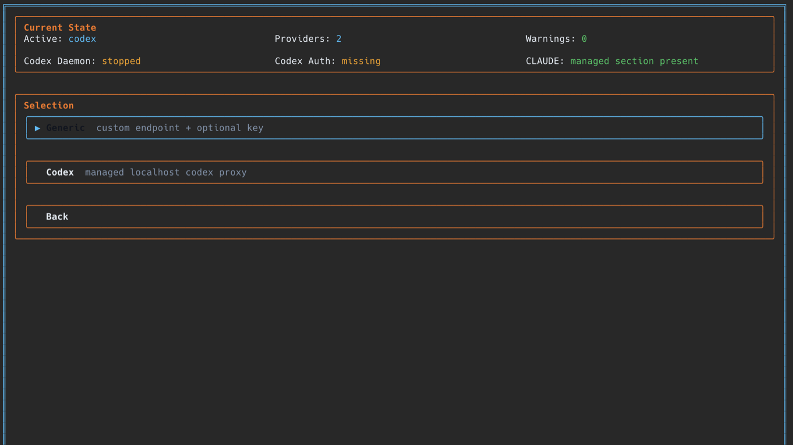
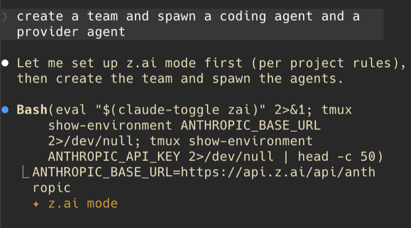

# CT Feature (WIP)

CT is a provider switcher plus local proxy layer that lets Claude-compatible workflows use different model backends with one command.

## What CT does

- Defines provider aliases (named providers) you can switch to with `ct <provider>`.
- Supports agent/provider mappings so teams can route agent types to specific providers.
- Includes a custom local Codex proxy that exposes an Anthropic-compatible endpoint while using your ChatGPT/Codex subscription behind the scenes.
- Lets you use your Codex subscription through Claude workflows by switching to the `codex` provider.

### Provider menu (TUI)

This is the provider selection view where generic providers and codex are managed/switched.



## Core usage

```bash
# Add a named provider alias
ct provider add openrouter generic https://openrouter.ai/api/v1 $OPENROUTER_API_KEY

# Switch by alias
eval "$(ct openrouter)"

# Switch to Codex via local proxy
eval "$(ct codex)"

# Full Codex setup (enable provider + daemon + auth)
ct codex --onboard

# View status
ct status
ct codex --status
```

### Claude using CT

This shows Claude actually invoking the tool and running CT-managed shell commands.



## Codex proxy behavior

When `codex` is active, CT manages env/config so Claude-compatible clients point to the local proxy endpoint (`http://127.0.0.1:4096/v1`) and use managed credentials/auth flow.

## Local dev note

In this repo, run with the local token file:

```bash
CODEX_PROXY_TOKEN_FILE=/Users/chrismck/Code/codex_in_claude_code/.tokens.json npm run start
```

## Acknowledgements

- Some of this implementation is based on `numman-ali/opencode-openai-codex-auth`: https://github.com/numman-ali/opencode-openai-codex-auth
- We also borrowed from opencode's PKCE OpenAI Codex login approach: https://github.com/anomalyco/opencode
- Thank you to z.ai GLM for coding most of this, and Codex for fixing what GLM coded.

## Status

This feature is a work in progress. Current effort is focused on improving tool-call usage and reliability in the Codex proxy specifically.
